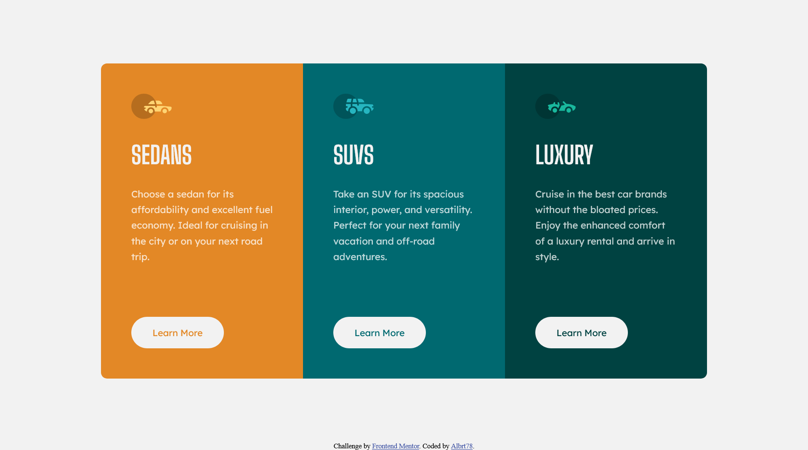

# Frontend Mentor - 3-column preview card component solution

This is a solution to the [3-column preview card component challenge on Frontend Mentor](https://www.frontendmentor.io/challenges/3column-preview-card-component-pH92eAR2-). Frontend Mentor challenges help you improve your coding skills by building realistic projects.

## Table of contents

-   [Overview](#overview)
-   [The challenge](#the-challenge)
-   [Screenshot](#screenshot)
-   [Links](#links)
-   [Built with](#built-with)
-   [Author](#author)

## Overview

Frontend Mentor is an online platform that provides challenges for web developers to improve their skills by building realistic projects. These challenges typically involve creating frontend designs based on provided designs or specifications.

### The challenge

Users should be able to:

-   View the optimal layout depending on their device's screen size
-   See hover states for interactive elements

### Screenshot

### Links

-   Solution URL: [3 Column Preview Card](https://github.com/Albrt78/3columnpreviewcard.github.io)
-   Live Site URL: [3 Column Preview Card](https://albrt78.github.io/3columnpreviewcard.github.io/)

### Built with

-   Semantic HTML5 markup
-   CSS custom properties
-   CSS Grid
-   [SCSS](https://sass-lang.com/) - CSS Preprocessor

## Author

-   Frontend Mentor - [@Albrt78](https://www.frontendmentor.io/profile/Albrt78)
